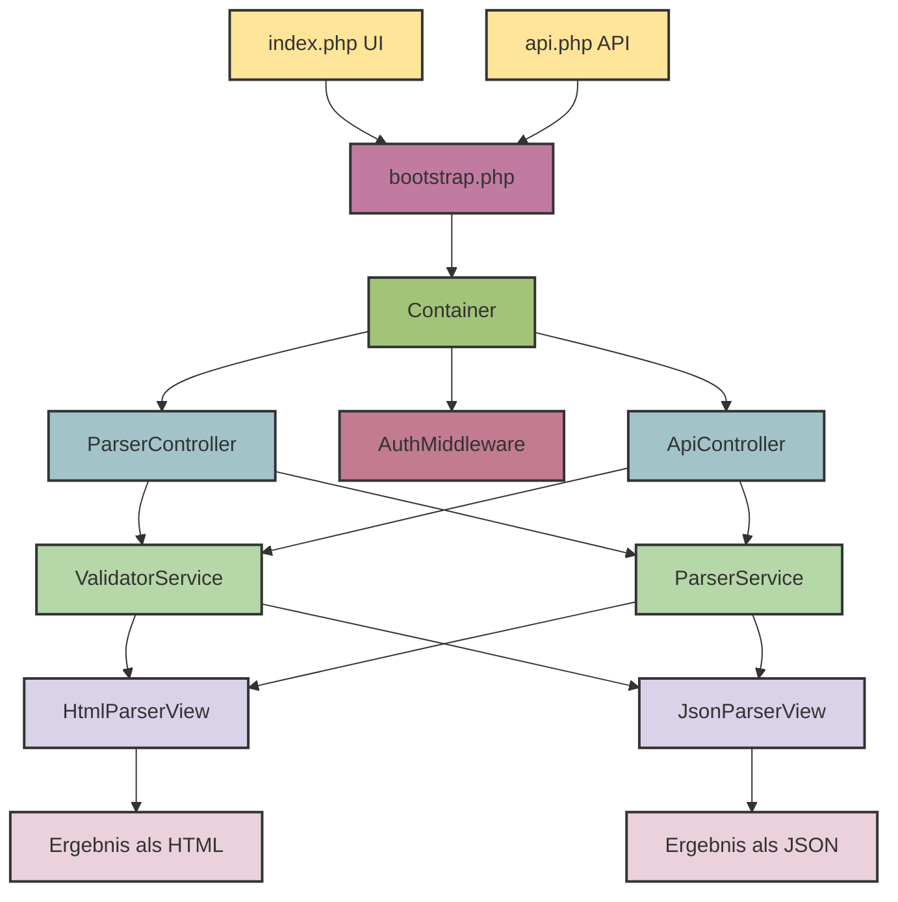

<p align="center">
    
</p>

<div style="display:flex; align-items:center; flex-wrap:wrap; gap:7px;">
  <a href="https://codecov.io/gh/niccolovettorello1997/docparser-php">
    
  </a>
  
  
  
  
  
  <a href="https://docparser-php.onrender.com" target="_blank">
    
  </a>
</div>

---

# DocParser-PHP

Ein leichtgewichtiger **Dokumentenparser und Validierungs-Microservice**, geschrieben in **PHP 8.3**, entwickelt, um **Clean Architecture**, **Dependency Injection**, **REST API Design** und **automatisiertes Testen** zu demonstrieren.

Ursprünglich als einfacher webbasierter HTML-Validator entwickelt, bietet **DocParser-PHP** nun sowohl:

* eine benutzerfreundliche **Weboberfläche (Web UI)** als auch
* eine **REST-API** (`/api/v1/*`) für automatisierten oder programmatischen Zugriff.

---

## **Visuelle Demo (Web UI)**

<p align="center">
    <a href="https://docparser-php.onrender.com/"></a>
</p>

---

## **Englische Version**

[README auf Englisch](README.md)

---

## **Inhaltsverzeichnis**

- [Funktionen](#funktionen)
- [Architekturübersicht](#architekturübersicht)
- [Technologie-Stack](#technologie-stack)
- [Nachgewiesene Fähigkeiten](#nachgewiesene-fähigkeiten)
- [Installation](#installation)
- [Umgebungskonfiguration](#umgebungskonfiguration)
- [Verwendung](#verwendung)
  - [Web UI](#web-ui)
  - [REST API](#rest-api)
- [Projektstruktur](#projektstruktur)
- [Validierungs- und Parsing-Logik](#validierungs--und-parsing-logik)
- [Tests & Qualitätssicherung](#tests--qualitätssicherung)
- [CI/CD mit GitHub Actions](#cicd-mit-github-actions)
- [Mitwirken](#mitwirken)
- [F.A.Q.](#faq)
- [Lizenz](#lizenz)

---

## **Funktionen**

* Saubere Microservice-Architektur (Web UI + REST API)
* HTML-Validierung mit strengen und erweiterbaren Regeln:

  * Korrekte Verschachtelung und Einzigartigkeit von `<html>`, `<head>`, `<body>`, `<title>`, etc.
  * Prüfung auf ungültige oder leere Tags
  * Optionale Attribut-Warnungen
* Parsen von HTML in eine strukturierte, DOM-ähnliche Baumstruktur
* Platzhalter für Markdown-Parsing, um die Erweiterbarkeit des Codes zu demonstrieren
* Ausgabe in:

  * Menschlich lesbares HTML
  * Strukturiertes JSON
* Konfigurierbar über `.env` und YAML-Dateien
* Dockerisiert für konsistente Umgebungen
* Über 98 % PHPUnit-Testabdeckung (Unit + Integration)
* Optionale Authentifizierungsmiddleware über API-Token (derzeit Platzhalter)
* CI-fähig mit Codecov-Integration

---

## **Architekturübersicht**



---

## **Technologie-Stack**

* **PHP 8.3** mit striktem Typing
* **Composer** für Abhängigkeitsverwaltung
* **Docker & Docker Compose**
* **Eigener Dependency Injection Container**
* **AuthMiddleware** für API-Authentifizierung (Platzhalter)
* **Guzzle** für Integrationstests
* **PHPUnit** für Tests + Codecov für Coverage
* **Apache** Webserver
* **Render** für Deployment

---

## **Nachgewiesene Fähigkeiten**

* RESTful Microservice-Architektur in PHP
* Saubere Trennung zwischen UI- und API-Schichten
* Dependency Injection und automatische Serviceauflösung
* Benutzerdefiniertes Routing mit dem eingebauten PHP-Server
* Middleware-basierte Authentifizierung
* Unit- und Integrationstests
* CI/CD-Pipelines mit GitHub Actions
* Docker-basierter Entwicklungsworkflow
* Konfigurationsgesteuertes Verhalten über `.env`

---

## **Installation**

1. Repository klonen:

```bash
git clone https://github.com/niccolovettorello1997/docparser-php.git
cd docparser-php
```

2. Docker-Umgebung starten:

```bash
docker compose up -d
```

3. In den Container wechseln:

```bash
docker exec -it docparser-php-web-1 bash
```

4. Abhängigkeiten installieren:

```bash
composer install
```

---

## **Umgebungskonfiguration**

Beispieldatei kopieren und nach Bedarf bearbeiten:

```bash
cp envs/.env.dev .env
```

Beispiel `.env`:

```
AUTH_REQUIRED=0
APP_VERSION="0.0.1"
```

| Variable        | Beschreibung                                 |
| --------------- | -------------------------------------------- |
| `AUTH_REQUIRED` | Aktiviert Token-Authentifizierung (1 oder 0) |
| `APP_VERSION`   | Aktuelle Anwendungsversion                   |

`.env` wird automatisch von `bootstrap.php` geladen.

---

## **Verwendung**

### Web UI

1. Öffne [http://localhost:8080](http://localhost:8080)
2. HTML-Inhalt einfügen oder hochladen
3. Validierungsergebnisse und geparsten Baum ansehen
4. Optional die JSON-Ausgabe herunterladen

---

### REST API

Der Service bietet REST-Endpunkte unter `/api/v1`.

Um die vollständige Dokumentation zu sehen, öffne in deinem Browser [http://localhost:8080/api/v1/docs](http://localhost:8080/api/v1/docs)

#### **GET** `/api/v1/health`

Healthcheck-Endpunkt.

```json
{
  "status": "ok",
  "version": "0.0.1"
}
```

#### **POST** `/api/v1/parse/file`

Parst und validiert den Inhalt einer hochgeladenen Datei.

**Beispielanfrage:**

```bash
curl -X POST http://localhost:8080/api/v1/parse/file -F "document=@/path/to/your/file.html" -F "type=html"
```

**Beispielantwort:**

```json
{
  "status": "ok",
  "requestId": "req-f77ecced103d7f6d",
  "validation": {
    "Valid": "yes",
    "Errors": [],
    "Warnings": []
  },
  "parsed": {
    "Name": "root",
    "Children": [
      {
        "Name": "doctype",
        "Children": [
          {
            "Name": "html",
            "Attributes": {
              "lang": "en"
            },
            "Children": [
              {
                "Name": "head",
                "Children": [
                  {
                    "Name": "title",
                    "Content": "Example Document"
                  }
                ]
              },
              {
                "Name": "body",
                "Children": [
                  {
                    "Name": "paragraphs",
                    "Children": [
                      {
                        "Name": "p",
                        "Content": "This is the first section of the page."
                      },
                      {
                        "Name": "p",
                        "Content": "This is the second section. Notice that headings, paragraphs, and links are all valid here."
                      },
                      {
                        "Name": "p",
                        "Content": "&amp;copy; 2025 Example Company"
                      }
                    ]
                  },
                  {
                    "Name": "headings",
                    "Children": [
                      {
                        "Name": "h1",
                        "Content": "Welcome to My Page"
                      },
                      {
                        "Name": "h2",
                        "Content": "Section 1"
                      },
                      {
                        "Name": "h2",
                        "Content": "Section 2"
                      }
                    ]
                  }
                ]
              }
            ]
          }
        ]
      }
    ]
  },
  "meta": {
    "durationMs": 18,
    "sizeBytes": 901,
    "version": "0.0.1"
  }
}
```

#### **POST** `/api/v1/parse/json`

Parst und validiert den Inhalt einer JSON-Anfrage.
Der Inhalt muss *URL-codiert* sein.

**Beispielanfrage:**

```bash
curl -d '{"type":"html", "content":"%3C%21DOCTYPE%20html%3E%0A%3Chtml%20lang%3D%22en%22%3E%0A%3Chead%3E%0A%20%20%3Cmeta%20charset%3D%22UTF-8%22%3E%0A%20%20%3Cmeta%20name%3D%22viewport%22%20content%3D%22width%3Ddevice-width%2C%20initial-scale%3D1.0%22%3E%0A%20%20%3Ctitle%3EExample%20Document%3C%2Ftitle%3E%0A%20%20%3Cmeta%20name%3D%22description%22%20content%3D%22A%20simple%20example%20of%20a%20well-structured%20HTML5%20document.%22%3E%0A%3C%2Fhead%3E%0A%3Cbody%3E%0A%20%20%3Cheader%3E%0A%20%20%20%20%3Ch1%3EWelcome%20to%20My%20Page%3C%2Fh1%3E%0A%20%20%20%20%3Cnav%3E%0A%20%20%20%20%20%20%3Cul%3E%0A%20%20%20%20%20%20%20%20%3Cli%3E%3Ca%20href%3D%22http%3A%2F%2Fwww.example1.com%22%3Eexample%201%3C%2Fa%3E%3C%2Fli%3E%0A%20%20%20%20%20%20%20%20%3Cli%3E%3Ca%20href%3D%22http%3A%2F%2Fwww.example2.com%22%3Eexample%202%3C%2Fa%3E%3C%2Fli%3E%0A%20%20%20%20%20%20%3C%2Ful%3E%0A%20%20%20%20%3C%2Fnav%3E%0A%20%20%3C%2Fheader%3E%0A%0A%20%20%3Cmain%3E%0A%20%20%20%20%3Csection%20id%3D%22section1%22%3E%0A%20%20%20%20%20%20%3Ch2%3ESection%201%3C%2Fh2%3E%0A%20%20%20%20%20%20%3Cp%3EThis%20is%20the%20first%20section%20of%20the%20page.%3C%2Fp%3E%0A%20%20%20%20%3C%2Fsection%3E%0A%0A%20%20%20%20%3Csection%20id%3D%22section2%22%3E%0A%20%20%20%20%20%20%3Ch2%3ESection%202%3C%2Fh2%3E%0A%20%20%20%20%20%20%3Cp%3EThis%20is%20the%20second%20section.%20Notice%20that%20headings%2C%20paragraphs%2C%20and%20links%20are%20all%20valid%20here.%3C%2Fp%3E%0A%20%20%20%20%3C%2Fsection%3E%0A%20%20%3C%2Fmain%3E%0A%0A%20%20%3Cfooter%3E%0A%20%20%20%20%3Cp%3E%26copy%3B%202025%20Example%20Company%3C%2Fp%3E%0A%20%20%3C%2Ffooter%3E%0A%3C%2Fbody%3E%0A%3C%2Fhtml%3E"}' -H "Content-Type: application/json" -X POST http://localhost:8080/api/v1/parse/json
```

**Beispielantwort:**

*(identisch zum Originalbeispiel)*

---

## **Projektstruktur**

```
src/               # Quellcode (Controller, Middleware, Validatoren, Parser)
public/            # Einstiegspunkte (UI und API)
 ├── index.php     # Web UI
 ├── api.php       # REST API
bootstrap.php      # Initialisiert DI-Container und Umgebung
tests/             # Unit- und Integrationstests
 ├── Unit/         # Unit-Tests (98 % Abdeckung)
 ├── Integration/  # Guzzle-basierte API-Tests
 ├── Config/       # Konfigurationstests
 ├── Performance/  # Performance-Tests
config/            # Parser- und Validator-Konfiguration
assets/            # Bilder und statische Dateien
docker/            # Docker-Konfiguration
```

---

## **Validierungs- und Parsing-Logik**

Validierung und Parsing werden zwischen der UI- und der API-Schicht gemeinsam genutzt:

1. **Validierung**

   * Stellt strukturelle Korrektheit sicher (doctype, head, body, title)
   * Erkennt leere oder ungültige Elemente
   * Unterscheidet zwischen Fehlern und Warnungen

2. **Parsing**

   * Erstellt einen rekursiven, DOM-ähnlichen Knotenbaum
   * Unterstützt mehrere Dokumenttypen (`HTML`, `Markdown`)
   * Ausgabe als HTML oder JSON möglich

---

## **Tests & Qualitätssicherung**

### Unit-Tests

* Decken Validatoren, Parser und View-Komponenten ab
* Ausführen mit `vendor/bin/phpunit`

### Integrationstests

Verwenden **Guzzle**, um Live-Endpunkte zu testen:

```php
$response = $client->get('/api/v1/health');
$this->assertEquals(200, $response->getStatusCode());
```

Ausführen mit `vendor/bin/phpunit`

Die Gesamtabdeckung wird automatisch von der CI-Pipeline an **Codecov** übermittelt.

---

## **CI/CD mit GitHub Actions**

### 1. Tests & Coverage (`tests.yml`)

Führt PHPUnit mit Coverage aus, lädt Ergebnisse zu Codecov hoch.

### 2. Statische Analyse (`phpstan.yaml`)

Führt strikte Typprüfungen durch.

### 3. Code-Stil (`php_cs_fixer.yaml`)

Sichert die Einhaltung des PSR-12-Codestils.

### 4. Docker-Build (`docker_build.yaml`)

Erstellt das Docker-Image mit `docker compose`.

### 5. Release & Deployment (`release_deploy.yaml`)

Löst ein Render-Deployment über die API aus.

### 6. Openapi (`openapi.yaml`)

Validiert die `openapi.yaml`-Dokumentationsdatei.

---

## **Mitwirken**

Beiträge sind willkommen!
Du kannst:

* Validierungsregeln erweitern
* Neue Dokumenttypen hinzufügen
* REST-API-Antworten verbessern
* Neue CI-Workflows oder Metriken hinzufügen (z. B. geplanter `/metrics`-Endpunkt)

Bitte öffne einen Pull Request oder ein Issue zur Diskussion.

---

## **F.A.Q.**

1. **XDebug funktioniert auf meinem Linux-System nicht – warum?**

Unter Linux löst Docker `host.docker.internal` nicht automatisch zur Host-Maschine auf.
Du musst die XDebug-Konfiguration von:

```
xdebug.client_host=host.docker.internal
```

ändern zu:

```
xdebug.client_host=172.17.0.1
```

Der schnellste Weg, dies zu beheben, besteht darin, deine `Dockerfile` entsprechend zu aktualisieren und den Container neu zu bauen.
Auf einigen Linux-Systemen musst du eventuell `ip addr show docker0` ausführen, um die tatsächliche Bridge-IP zu überprüfen (normalerweise `172.17.0.1`).

---

## **Lizenz**

MIT-Lizenz © 2025 Niccolò Vettorello

---