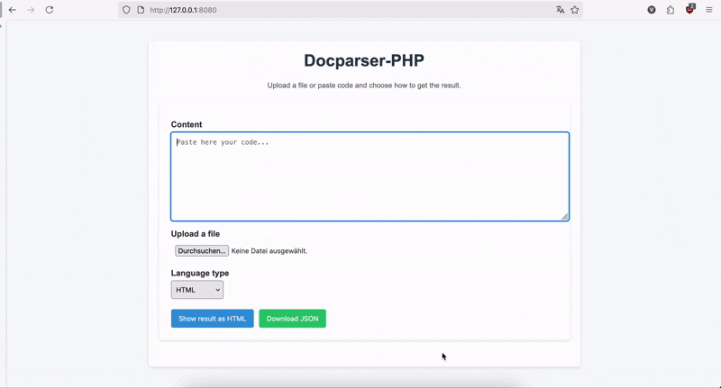

<p align="center">
    
</p>

<a href="https://codecov.io/gh/niccolovettorello1997/docparser-php" > 
 
 
 
 
</a>

---

# DocParser-PHP

Ein einfacher **HTML-Parser und -Validator**, geschrieben in PHP 8, entworfen als Lernprojekt zur Demonstration von **objektorientiertem PHP, Unit-Testing und modularer Architektur**. Dieses Projekt stellt eine praktische Übung dar, die nach dem Studium des Buches *PHP 8 und MySQL: das umfassende Handbuch* von Wenz und Hauser geschrieben wurde. Es zeigt bewährte Programmierpraktiken, strukturiertes Parsen, Validierung und Ausgabe-Rendering in HTML- und JSON-Formaten.

---

## **Visuelle Demo**

<p align="center">
    
</p>

---

## **Englische Version**

[README auf Englisch](README.md)

---

## **Inhaltsverzeichnis**

- [Funktionen](#funktionen)
- [Architekturübersicht](#architekturübersicht)
- [Technologie-Stack](#technologie-stack)
- [Gezeigte Fähigkeiten](#gezeigte-fähigkeiten)
- [Warum dieses Projekt wichtig ist](#warum-dieses-projekt-wichtig-ist)
- [Installation](#installation)
- [Verwendung](#verwendung)
- [Eingabe/Ausgabe Beispiel](#ea-beispiel)
- [Projektstruktur](#projektstruktur)
- [Validierungs- und Parsing-Logik](#validierungs--und-parsing-logik)
- [Beitragen](#beitragen)
- [Lizenz](#lizenz)

---

## **Funktionen**

- Validierung der HTML-Struktur mit strengen Regeln:
  - Einzigartige und korrekt verschachtelte `<html>`, `<head>`, `<body>`, `<title>` und Überschriften
  - Prüfung auf leere Elemente und ungültige Zeichen
  - Warnsystem für optionale Attribute
- Parsen von HTML in eine strukturierte, DOM-ähnliche Baumstruktur
- Die aktuelle Implementierung konzentriert sich auf Validierung und modulares Design; vollständige HTML-Unterstützung kann dank der Architektur problemlos erreicht werden
- Ausgabe der Ergebnisse in:
  - Menschlich lesbares HTML
  - Strukturiertes JSON für weitere Verarbeitung
- Modulare Architektur zur Unterstützung zusätzlicher Dokumenttypen (*Stub-Code* für Markdown als Beispiel)
- Vollständig mit PHPUnit getestet
- Dockerisiert für einfache Einrichtung
- Konfigurierbare Validatoren und Parser über YAML

---

## **Architekturübersicht**


---

## **Technologie-Stack**

- **PHP 8.3** (OOP, striktes Typing)  
- **Composer** für Abhängigkeitsmanagement  
- **Docker & Docker Compose** für die Umgebung  
- **PHPUnit** für Unit-Tests  
- HTML5-Standards

---

## **Gezeigte Fähigkeiten**
- Stark typisiertes PHP 8.3 mit Schnittstellen und abstrakten Klassen
- Factory + Strategy-Muster für Erweiterbarkeit
- Dependency Injection Prinzipien
- Unit-Tests, Integrationstests, Performance-Tests und Regressionstests mit PHPUnit
- Composer für Abhängigkeitsverwaltung
- CI/CD mit GitHub Actions
- Dockerisierte Umgebung für Portabilität
- Erweiterbares Design für neue Parser/Validatoren

---

## **Warum dieses Projekt wichtig ist**

Dieses Projekt zeigt meine Fähigkeit:

- **Modulare, erweiterbare Software in PHP zu entwerfen**

- **Validierungs- und Parsing-Pipelines für reale Anwendungsfälle zu implementieren**

- **Testgetriebene Entwicklung anzuwenden (Abdeckung >90%)**

- **Eine Anwendung mit Docker für Portabilität bereitzustellen**

---

## **Installation**

1. Repository klonen:

```bash
git clone https://github.com/niccolovettorello1997/docparser-php.git
cd docparser-php
```

2. Docker-Umgebung starten:

```bash
docker compose up -d
```

3. In den Web-Container wechseln:

```bash
docker exec -it docparser-php-web-1 bash
```

4. PHP-Abhängigkeiten installieren:

```bash
composer install
```

5. Zugriff auf die App im Browser:

```
http://localhost:8080
```

---

## **Verwendung**

1. HTML-Inhalt direkt in das Textfeld eingeben **oder** eine HTML-Datei hochladen.
2. Datentyp auswählen (derzeit nur `HTML` und *Stub-Code* für `Markdown` unterstützt).
3. Auf **Parse** klicken.
4. Ergebnisse werden angezeigt:

   * Validierungsfehler und Warnungen
   * Geparste HTML-Ansicht
   * Optionale herunterladbare JSON-Datei

---

## E/A Beispiel

**HTML Eingabe**
```html
<!DOCTYPE html>
<html lang="de">
  <head><title>Test</title></head>
  <body>
    <h1>Hello</h1>
    <p>World</p>
  </body>
</html>
```

**JSON Ausgabe für HTML**
```json
{
    "Name": "root",
    "Children": [
        {
            "Name": "doctype",
            "Children": [
                {
                    "Name": "html",
                    "Attributes": {
                        "lang": "de"
                    },
                    "Children": [
                        {
                            "Name": "head",
                            "Children": [
                                {
                                    "Name": "title",
                                    "Content": "Test"
                                }
                            ]
                        },
                        {
                            "Name": "body",
                            "Children": [
                                {
                                    "Name": "paragraphs",
                                    "Children": [
                                        {
                                            "Name": "p",
                                            "Content": "World"
                                        }
                                    ]
                                },
                                {
                                    "Name": "headings",
                                    "Children": [
                                        {
                                            "Name": "h1",
                                            "Content": "Hello"
                                        }
                                    ]
                                }
                            ]
                        }
                    ]
                }
            ]
        }
    ]
}
```

**Markdown Eingabe (*stub*)**
```md
# Example title
```

**JSON Ausgabe für Markdown**
```json
{
    "Name": "root",
    "Children": [
        {
            "Name": "markdown",
            "Content": "# Example title"
        }
    ]
}
```

---

## **Projektstruktur**

```
src/          # Core PHP Quellcode (Validatoren, Parser, Fabriken)
tests/        # PHPUnit Tests für Validatoren, Parser und Views
views/        # HTML-Views für Validierungsergebnisse
public/       # Einstiegspunkt für die Web-Oberfläche
docker/       # Docker-Konfiguration
config/       # Einstellungen für Parser und Validator
fixtures/     # Projekt-Fixtures
assets/       # Projekt-Assets
```

---

## **Validierungs- und Parsing-Logik**

1. **Validierung**

   * Überprüfungen beinhalten:

     * Einzigartiger `doctype`, `html`, `head`, `body`, `title`
     * Ausgeglichene Überschriften (`<h1>`-`<h6>`)
     * Keine verschachtelten `<p>`-Tags oder ungültiger Inhalt
     * Warnungen für optionale Attribute (z. B. `lang` auf `<html>`)

2. **Parsing**

   * Konvertiert HTML in eine DOM-ähnliche Baumstruktur
   * Jeder Elementtyp wird von dedizierten Parser-Klassen behandelt
   * Rekursives Parsen vom `doctype`-Root
   * Ausgaben können in HTML oder JSON gerendert werden

---

## **Tests & Qualitätssicherung**

Dieses Projekt verfügt über eine umfangreiche PHPUnit-Testabdeckung, um Zuverlässigkeit und Wartbarkeit sicherzustellen:

* Unit-Tests für Validatoren (fehlende Tags, Duplikate, ungültiger oder leerer Inhalt).

* Integrationstests (Validator + Parser + Views).

* YAML-Konfigurationstests (dynamische Validator- und Parserkonfiguration).

* Edge-Case-HTML-Tests (nicht standardisierte Strukturen, Leerzeichen, Kommentare).

* Performance-Tests mit großen Eingaben (10.000+ Tags).

Fehler und Warnungen werden klar getrennt: Fehler blockieren das Parsing, während Warnungen es fortsetzen lassen.

Tests ausführen:

```bash
docker exec -it docparser-php-web-1 bash
vendor/bin/phpunit
```

---

## **Beitragen**

Beiträge sind willkommen! Sie können:

* Unterstützung für weitere HTML-Tags hinzufügen
* Validierungsregeln verbessern
* Unterstützung für andere Dokumenttypen (Markdown, XML) hinzufügen
* UI/JSON-Ausgabe erweitern

Bitte öffnen Sie einen Pull-Request oder Issue zur Diskussion.

---

## **Lizenz**

MIT-License

---