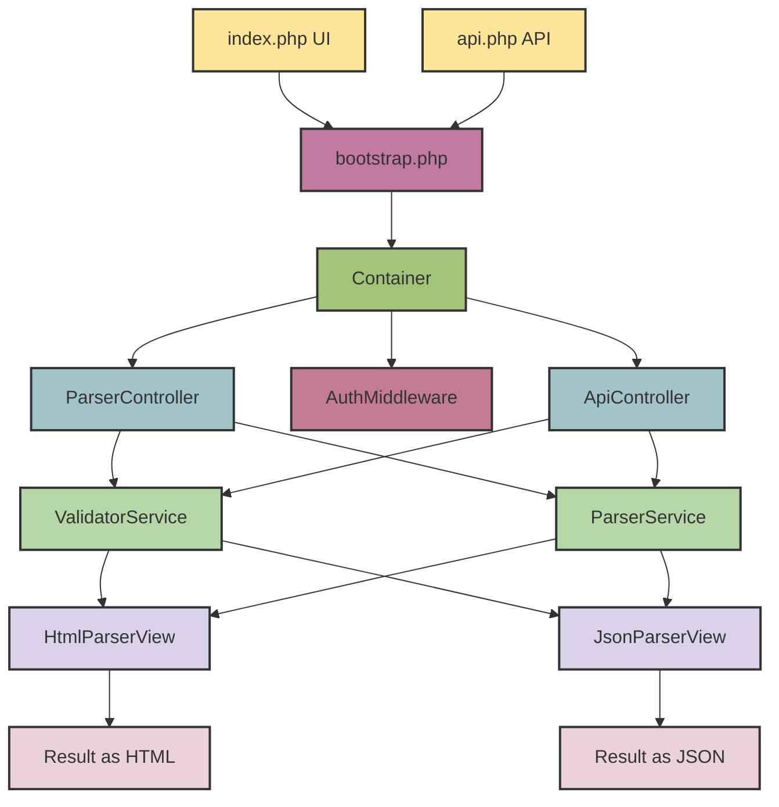

<p align="center">
    
</p>

<div style="display:flex; align-items:center; flex-wrap:wrap; gap:7px;">
  <a href="https://codecov.io/gh/niccolovettorello1997/docparser-php">
    
  </a>
  
  
  
  
  
  <a href="https://docparser-php.onrender.com" target="_blank">
    
  </a>
</div>

---

# DocParser-PHP

A lightweight **document parser and validator microservice**, written in **PHP 8.3**, designed to demonstrate **Clean Architecture**, **Dependency Injection**, **REST API design**, and **automated testing**.

Originally built as a simple web-based HTML validator, **DocParser-PHP** now exposes both:
- a user-friendly **web UI**, and  
- a **REST API** (`/api/v1/*`) for automated or programmatic access.

---

## **Visual Demo (Web UI)**

<p align="center">
    <a href="https://docparser-php.onrender.com/"></a>
</p>

---

## **German version**

[README in German](README.de.md)

---

## **API documentation**

The API documentation is available [here](https://niccolovettorello1997.github.io/docparser-php/).

---

## **Table of Contents**

- [Features](#features)
- [Architecture Overview](#architecture-overview)
- [Technology Stack](#technology-stack)
- [Skills Demonstrated](#skills-demonstrated)
- [Installation](#installation)
- [Environment Configuration](#environment-configuration)
- [Usage](#usage)
  - [Web UI](#web-ui)
  - [REST API](#rest-api)
- [Project Structure](#project-structure)
- [Validation and Parsing Logic](#validation-and-parsing-logic)
- [Tests & Quality Assurance](#tests--quality-assurance)
- [CI/CD with GitHub Actions](#cicd-with-github-actions)
- [Contributing](#contributing)
- [F.A.Q.](#faq)
- [License](#license)

---

## **Features**

- Clean microservice architecture (web UI + REST API)
- HTML validation with strict and extensible rules:
  - Proper nesting and uniqueness for `<html>`, `<head>`, `<body>`, `<title>`, etc.
  - Checks for invalid or empty tags
  - Optional attribute warnings
- Parse HTML into a structured DOM-like tree
- A stub for Markdown parsing is present to prove the extensibility of the codebase
- Output results in:
  - Human-readable HTML
  - Structured JSON
- Configurable via `.env` and YAML files
- Dockerized for consistent environments
- More than 98% PHPUnit test coverage (unit + integration)
- Optional authentication middleware via API token (only a stub for the moment)
- CI-ready with Codecov integration

---

## **Architecture Overview**



---

## **Technology Stack**

* **PHP 8.3** with strict typing
* **Composer** dependency management
* **Docker & Docker Compose**
* **Custom Dependency Injection Container**
* **AuthMiddleware** for API authentication (only a stub for the moment)
* **Guzzle** for integration tests
* **PHPUnit** for testing + Codecov for coverage
* **Apache** web server
* **Render** for deployment

---

## **Skills Demonstrated**

* RESTful microservice architecture in PHP
* Clean separation between UI and API layers
* Dependency Injection and automatic service resolution
* Custom routing with the built-in PHP server
* Middleware-based authentication
* Unit and integration testing
* CI/CD pipelines with GitHub Actions
* Dockerized development workflow
* Config-driven behavior via `.env`

---

## **Installation**

1. Clone the repository:

```bash
git clone https://github.com/niccolovettorello1997/docparser-php.git
cd docparser-php
```

2. Start the Docker environment:

```bash
docker compose up -d
```

3. Enter the container:

```bash
docker exec -it docparser-php-web-1 bash
```

4. Install dependencies:

```bash
composer install
```

---

## **Environment Configuration**

Copy the example file and edit it as needed:

```bash
cp envs/.env.dev .env
```

Example `.env`:

```
AUTH_REQUIRED=0
APP_VERSION="0.0.1"
```

| Variable                                          | Description                               |
| ------------------------------------------------- | ----------------------------------------- |
| `AUTH_REQUIRED`                                   | Enables token authentication (1 or 0)     |
| `APP_VERSION`                                     | Current application version               |

`.env` is automatically loaded by `bootstrap.php`

---

## **Usage**

### Web UI

1. Open [http://localhost:8080](http://localhost:8080)
2. Paste or upload HTML content
3. See validation results and parsed tree
4. Optionally download the JSON output

---

### REST API

The service exposes REST endpoints under `/api/v1`.

To see the complete documentation open in your browser [http://localhost:8080/api/v1/docs](http://localhost:8080/api/v1/docs)

#### **GET** `/api/v1/health`

Healthcheck endpoint.

```json
{
  "status": "ok",
  "version": "0.0.1"
}
```

#### **POST** `/api/v1/parse/file`

Parses and validates the content of an uploaded file.

**Example Request:**

```bash
curl -X POST http://localhost:8080/api/v1/parse/file -F "document=@/path/to/your/file.html" -F "type=html"
```

**Example Response:**

```json
{
  "status": "ok",
  "requestId": "req-f77ecced103d7f6d",
  "validation": {
    "Valid": "yes",
    "Errors": [],
    "Warnings": []
  },
  "parsed": {
    "Name": "root",
    "Children": [
      {
        "Name": "doctype",
        "Children": [
          {
            "Name": "html",
            "Attributes": {
              "lang": "en"
            },
            "Children": [
              {
                "Name": "head",
                "Children": [
                  {
                    "Name": "title",
                    "Content": "Example Document"
                  }
                ]
              },
              {
                "Name": "body",
                "Children": [
                  {
                    "Name": "paragraphs",
                    "Children": [
                      {
                        "Name": "p",
                        "Content": "This is the first section of the page."
                      },
                      {
                        "Name": "p",
                        "Content": "This is the second section. Notice that headings, paragraphs, and links are all valid here."
                      },
                      {
                        "Name": "p",
                        "Content": "&amp;copy; 2025 Example Company"
                      }
                    ]
                  },
                  {
                    "Name": "headings",
                    "Children": [
                      {
                        "Name": "h1",
                        "Content": "Welcome to My Page"
                      },
                      {
                        "Name": "h2",
                        "Content": "Section 1"
                      },
                      {
                        "Name": "h2",
                        "Content": "Section 2"
                      }
                    ]
                  }
                ]
              }
            ]
          }
        ]
      }
    ]
  },
  "meta": {
    "durationMs": 18,
    "sizeBytes": 901,
    "version": "0.0.1"
  }
}
```

#### **POST** `/api/v1/parse/json`

Parses and validates the content of a JSON request. The content must be *url encoded*.

**Example Request:**

```bash
curl -d '{"type":"html", "content":"%3C%21DOCTYPE%20html%3E%0A%3Chtml%20lang%3D%22en%22%3E%0A%3Chead%3E%0A%20%20%3Cmeta%20charset%3D%22UTF-8%22%3E%0A%20%20%3Cmeta%20name%3D%22viewport%22%20content%3D%22width%3Ddevice-width%2C%20initial-scale%3D1.0%22%3E%0A%20%20%3Ctitle%3EExample%20Document%3C%2Ftitle%3E%0A%20%20%3Cmeta%20name%3D%22description%22%20content%3D%22A%20simple%20example%20of%20a%20well-structured%20HTML5%20document.%22%3E%0A%3C%2Fhead%3E%0A%3Cbody%3E%0A%20%20%3Cheader%3E%0A%20%20%20%20%3Ch1%3EWelcome%20to%20My%20Page%3C%2Fh1%3E%0A%20%20%20%20%3Cnav%3E%0A%20%20%20%20%20%20%3Cul%3E%0A%20%20%20%20%20%20%20%20%3Cli%3E%3Ca%20href%3D%22http%3A%2F%2Fwww.example1.com%22%3Eexample%201%3C%2Fa%3E%3C%2Fli%3E%0A%20%20%20%20%20%20%20%20%3Cli%3E%3Ca%20href%3D%22http%3A%2F%2Fwww.example2.com%22%3Eexample%202%3C%2Fa%3E%3C%2Fli%3E%0A%20%20%20%20%20%20%3C%2Ful%3E%0A%20%20%20%20%3C%2Fnav%3E%0A%20%20%3C%2Fheader%3E%0A%0A%20%20%3Cmain%3E%0A%20%20%20%20%3Csection%20id%3D%22section1%22%3E%0A%20%20%20%20%20%20%3Ch2%3ESection%201%3C%2Fh2%3E%0A%20%20%20%20%20%20%3Cp%3EThis%20is%20the%20first%20section%20of%20the%20page.%3C%2Fp%3E%0A%20%20%20%20%3C%2Fsection%3E%0A%0A%20%20%20%20%3Csection%20id%3D%22section2%22%3E%0A%20%20%20%20%20%20%3Ch2%3ESection%202%3C%2Fh2%3E%0A%20%20%20%20%20%20%3Cp%3EThis%20is%20the%20second%20section.%20Notice%20that%20headings%2C%20paragraphs%2C%20and%20links%20are%20all%20valid%20here.%3C%2Fp%3E%0A%20%20%20%20%3C%2Fsection%3E%0A%20%20%3C%2Fmain%3E%0A%0A%20%20%3Cfooter%3E%0A%20%20%20%20%3Cp%3E%26copy%3B%202025%20Example%20Company%3C%2Fp%3E%0A%20%20%3C%2Ffooter%3E%0A%3C%2Fbody%3E%0A%3C%2Fhtml%3E"}' -H "Content-Type: application/json" -X POST http://localhost:8080/api/v1/parse/json
```

**Example Response:**

*See previous example response.*

---

## **Project Structure**

```
src/               # Core source code (controllers, middleware, validators, parsers)
public/            # Entry points (UI and API)
 ├── index.php     # Web UI
 ├── api.php       # REST API
bootstrap.php      # Initializes DI container and environment
tests/             # Unit and integration tests
 ├── Unit/         # Unit tests (98% coverage)
 ├── Integration/  # Guzzle-based API tests
 ├── Config/       # Configuration tests
 ├── Performance/  # Performance tests
config/            # Parser and validator configuration
assets/            # Images and static assets
docker/            # Docker configuration
```

---

## **Validation and Parsing Logic**

Validation and parsing are shared between the UI and API layers:

1. **Validation**

   * Ensures structural correctness (doctype, head, body, title)
   * Detects empty or invalid elements
   * Provides error vs warning distinction

2. **Parsing**

   * Builds a recursive DOM-like node tree
   * Supports multiple document types (`HTML`, `Markdown`)
   * Output can be rendered as HTML or JSON

---

## **Tests & Quality Assurance**

### Unit Tests

* Cover validators, parsers, and view components
* Run with `vendor/bin/phpunit`

### Integration Tests

Use **Guzzle** to hit live endpoints:

```php
$response = $client->get('/api/v1/health');
$this->assertEquals(200, $response->getStatusCode());
```

Run with `vendor/bin/phpunit`

Total coverage is uploaded to **Codecov** automatically by the CI pipeline.

---

## **CI/CD with GitHub Actions**

### 1. Tests & Coverage (`tests.yml`)

Runs PHPUnit with coverage, uploads to Codecov.

### 2. Static Analysis (`phpstan.yaml`)

Performs strict static type checks.

### 3. Coding Style (`php_cs_fixer.yaml`)

Ensures PSR-12 formatting compliance.

### 4. Docker Build (`docker_build.yaml`)

Builds Docker image using `docker compose`.

### 5. Release & Deploy (`release_deploy.yaml`)

Triggers a Render deployment via API.

### 6. Openapi (`openapi.yaml`)

Validates `openapi.yaml` documentation file.

---

## **Contributing**

Contributions are welcome!
You can:

* Extend validation rules
* Add new document types
* Improve REST API responses
* Add new CI workflows or metrics (`/metrics` endpoint planned)

Please open a pull request or issue to discuss.

---

## **F.A.Q.**

1. **XDebug is not working on my Linux system — why?**

  On Linux, Docker doesn't automatically resolve `host.docker.internal` to the host machine.
  You need to change the XDebug configuration from:

```
xdebug.client_host=host.docker.internal
```

  to:

```
xdebug.client_host=172.17.0.1
```

The fastest way to fix this is to update your `Dockerfile` accordingly and rebuild the container.
On some Linux setups, you might need to run `ip addr show docker0` to verify the actual bridge IP (usually `172.17.0.1`).

---

## **License**

MIT License © 2025 Niccolò Vettorello