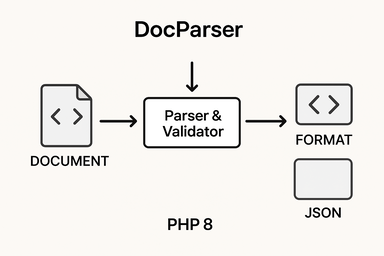
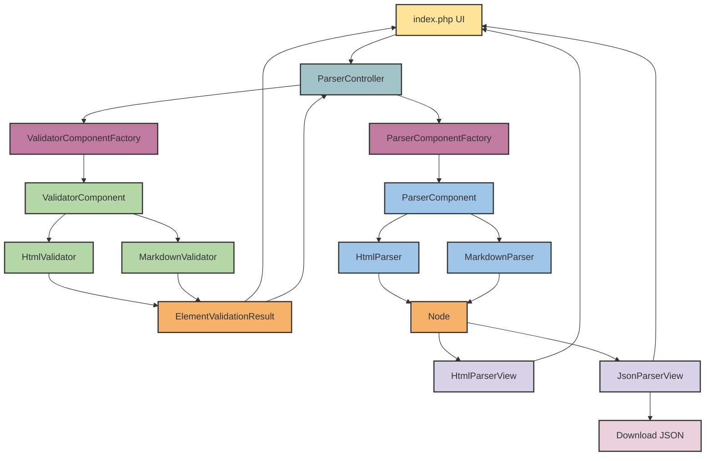

<p align="center">
    
</p>

<a href="https://codecov.io/gh/niccolovettorello1997/docparser-php" > 
 </a>
 
 
 
 
 
<a href="https://docparser-php.onrender.com" target="_blank">
    </a>

---

# DocParser-PHP

A simple **HTML parser and validator** written in PHP 8, designed as a learning project to demonstrate **object-oriented PHP, unit testing, and modular architecture**. This project represents a practical exercise written after studying the book *PHP 8 und MySQL: das umfassende Handbuch* by Wenz and Hauser. It showcases coding practices, structured parsing, validation, and output rendering in HTML and JSON formats.

---

## **Visual demo**

<p align="center">
    <a href="https://docparser-php.onrender.com/"></a>
</p>

---

## **German version**

[README in German](README.de.md)

---

## **Table of Contents**

- [Features](#features)
- [Architecture Overview](#architecture-overview)
- [Technology Stack](#technology-stack)
- [Skills Demonstrated](#skills-demonstrated)
- [Why this project matters](#why-this-project-matters)
- [Installation](#installation)
- [Usage](#usage)
- [Example Input/Output](#example-inputoutput)
- [Project Structure](#project-structure)
- [Validation and Parsing Logic](#validation-and-parsing-logic)
- [Tests & Quality Assurance](#tests--quality-assurance)
- [CI/CD with Github Actions](#cicd-with-github-actions)
- [Contributing](#contributing)
- [License](#license)

---

## **Features**

- Validate HTML structure with strict rules:
  - Unique and properly nested `<html>`, `<head>`, `<body>`, `<title>` and headings
  - Checks for empty elements and invalid characters
  - Warning system for optional attributes
- Parse HTML into a structured DOM-like tree
- Current implementation focuses on validation and modular design; full HTML support can be easily reached thanks to the architecture
- Output results in:
  - Human-readable HTML
  - Structured JSON for further processing
- Modular architecture to support additional document types (*stub* code for Markdown as example)
- Fully tested with PHPUnit
- Dockerized for easy setup
- Configurable validators and parsers via YAML

---

## **Architecture Overview**



---

## **Technology Stack**

- **PHP 8.3** (OOP, strict typing)
- **Composer** for dependency management
- **Docker & Docker Compose** for environment setup
- **PHPUnit** for unit testing
- HTML5 standards compliance

---

## **Skills Demonstrated**
- Strongly typed PHP 8.3 with interfaces and abstract classes
- Factory + Strategy pattern for extensibility
- Dependency Injection principles
- Unit testing, integration testing, performance testing and regression testing with PHPUnit
- Composer for dependency management
- CI/CD with GitHub Actions
- Dockerized environment for portability
- Extensible design for new parsers/validators

---

## **Why this project matters**

This project demonstrates my ability to:

- **Design modular, extensible software in PHP**

- **Implement real-world validation and parsing pipelines**

- **Apply test-driven development (coverage >90%)**

- **Package an application with Docker for portability**

---

## **Installation**

1. Clone this repository:

```bash
git clone https://github.com/niccolovettorello1997/docparser-php.git
cd docparser-php
```

2. Start the Docker environment:

```bash
docker compose up -d
```

3. Enter the web container:

```bash
docker exec -it docparser-php-web-1 bash
```

4. Install PHP dependencies:

```bash
composer install
```

5. Access the app in your browser:

```
http://localhost:8080
```

---

## **Usage**

1. Insert HTML content directly into the textarea **or** upload an HTML file.
2. Select the data type (currently only `HTML` and a *stub* for `Markdown` are supported).
3. Click **Parse**.
4. Results are displayed:

   * Validation errors and warnings
   * Parsed HTML view
   * Optional JSON downloadable file

---

## **Example Input/Output**

**Input HTML**

```html
<!DOCTYPE html>
<html lang="de">
  <head><title>Test</title></head>
  <body>
    <h1>Hello</h1>
    <p>World</p>
  </body>
</html>
```

**Output JSON for HTML**

```json
{
    "Name": "root",
    "Children": [
        {
            "Name": "doctype",
            "Children": [
                {
                    "Name": "html",
                    "Attributes": {
                        "lang": "de"
                    },
                    "Children": [
                        {
                            "Name": "head",
                            "Children": [
                                {
                                    "Name": "title",
                                    "Content": "Test"
                                }
                            ]
                        },
                        {
                            "Name": "body",
                            "Children": [
                                {
                                    "Name": "paragraphs",
                                    "Children": [
                                        {
                                            "Name": "p",
                                            "Content": "World"
                                        }
                                    ]
                                },
                                {
                                    "Name": "headings",
                                    "Children": [
                                        {
                                            "Name": "h1",
                                            "Content": "Hello"
                                        }
                                    ]
                                }
                            ]
                        }
                    ]
                }
            ]
        }
    ]
}
```

**Input Markdown (*stub*)**
```md
# Example title
```

**Output JSON for Markdown**
```json
{
    "Name": "root",
    "Children": [
        {
            "Name": "markdown",
            "Content": "# Example title"
        }
    ]
}
```

---

## **Project Structure**

```
src/          # Core PHP source code (validators, parsers, factories)
tests/        # PHPUnit tests for validators, parsers, and views
views/        # HTML views for displaying validation results
public/       # Entry point for the web interface
docker/       # Docker configuration
config/       # Settings for parser and validator
fixtures/     # Project fixtures
assets/       # Project assets
```

---

## **Validation and Parsing Logic**

1. **Validation**

   * Checks include:

     * Unique `doctype`, `html`, `head`, `body`, `title`
     * Balanced headings (`<h1>`-`<h6>`)
     * No nested `<p>` or invalid content
     * Warnings for optional attributes (e.g., `lang` on `<html>`)

2. **Parsing**

   * Converts HTML into a DOM-like tree structure
   * Each element type handled by dedicated parser classes
   * Recursive parsing from `doctype` root
   * Outputs can be rendered in HTML or JSON

---

## **Tests & Quality Assurance**

This project includes extensive PHPUnit test coverage, ensuring reliability and maintainability:

* Unit tests for validators (missing tags, duplicates, invalid or empty content).

* Integration tests (validator + parser + views).

* YAML configuration tests (dynamic validator and parser configuration).

* Edge case HTML tests (non-standard structures, whitespace, comments).

* Performance tests with large inputs (10k+ tags).

Errors and warnings are clearly separated: errors block parsing, while warnings allow it to continue.

To run tests:

```bash
docker exec -it docparser-php-web-1 bash
vendor/bin/phpunit
```

---

## CI/CD with GitHub Actions

This project uses **GitHub Actions** to automate testing, code quality checks, Docker builds, and deployments. The workflow is split into several jobs, each with a specific purpose.

### 1. Tests & Coverage

**File:** `tests.yaml`

**Purpose:** Run PHPUnit tests and generate code coverage.

**What it does:**
- Installs PHP 8.3 with Xdebug
- Installs project dependencies
- Runs PHPUnit and generates coverage reports
- Uploads coverage to Codecov

**Run locally:**

```bash
vendor/bin/phpunit
```

### 2. PHPStan

**File:** `phpstan.yaml`

**Purpose:** Perform static code analysis using PHPStan.

**What it does:**

* Installs PHP 8.3
* Installs project dependencies
* Runs PHPStan to check for type errors and other static issues
* By default PHPStan strictness is set to `max`

**Run locally:**

```bash
vendor/bin/phpstan analyse
```

### 3. PHP CS Fixer

**File:** `php_cs_fixer.yaml`

**Purpose:** Check code formatting and coding style.

**What it does:**

* Installs PHP 8.3
* Installs project dependencies

**Run locally:**

```bash
vendor/bin/php-cs-fixer fix
```

### 4. Docker Build

**File:** `docker_build.yaml`

**Purpose:** Build the project Docker image.

**What it does:**

* Sets up Docker Buildx
* Builds the Docker image using `docker compose build`
* Does **not** push the image

**Run locally:**

```bash
docker compose build
```

### 5. Release & Deploy

**File:** `release_deploy.yaml`

**Purpose:** Trigger deployment to Render.

**Triggers:** Manual (`workflow_dispatch`)

**What it does:**

* Sends a POST request to the Render API to deploy the latest code
* Uses secrets `RENDER_API_KEY` and `RENDER_SERVICE_ID` for authentication
* Can be triggered only by having the right access to the repository

**Run locally:**

```bash
curl -X POST "https://api.render.com/v1/services/<RENDER_SERVICE_ID>/deploys" \
     -H "Authorization: Bearer <RENDER_API_KEY>" \
     -H "Content-Type: application/json" \
     -d '{}'
```

---

## **Contributing**

Contributions are welcome! You can:

* Add support for more HTML tags
* Improve validation rules
* Add support for other document types (Markdown, XML)
* Enhance UI/JSON output

Please open a pull request or issue for discussion.

---

## **License**

MIT License

---